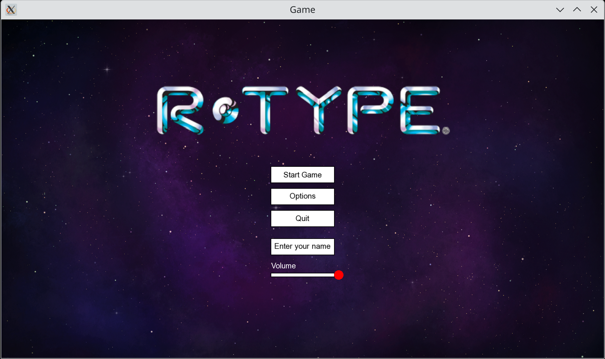

<a name="readme-top"></a>

[![Contributors][contributors-shield]][contributors-url]
[![Stargazers][stars-shield]][stars-url]
[![MIT License][license-shield]][license-url]



# R-Type

<b>binary:</b> `r-type_client`, `r-type_server`, `r-type_editor`
<b>language:</b> C++  
<b>build:</b> CMake, package manage

> [!NOTE]
> Your Makefile should contain a r-type_client, a r-type_server and a r-type_editor rules to compile the eponymous binaries.

> [!TIP]
> You can use the whole C++ standard library.

This project of the Advanced C++ knowledge unit will introduce you to networked video game development, and will give you the opportunity to explore advanced development techniques as well as to learn good software engineering practices.  
The goal is to implement a multi-threaded server and a graphical client for a well-known legacy video game called R-Type, using a game engine of your own design.  
First, you will develop the core architecture of the game and deliver a working prototype, and in a second time, you will expand several aspects the prototype to the next level, exploring specialized areas of your choice from a list of proposed options.  


## Documentation

## Documentation

The documentation for this project is available in two formats:

1. **Docusaurus**: A modern static website generator that you can use to view the documentation in a web format. To run the Docusaurus documentation, use the following command:
    ```bash
    npm install
    npm run start
    ```
    This will start a local server and open the documentation in your default web browser.

2. **Doxygen**: The code is documented using Doxygen, a documentation generator for C++ projects. To generate and view the Doxygen documentation, use the following commands:
    ```bash
    doxygen Doxyfile
    ```
    This will generate the documentation in the `docs` directory. Open the `index.html` file in your web browser to view the documentation.


### Global Architecture


## Usage

### Build

#### Linux

To build the project on Linux, follow these steps:

1. Ensure you have `CMake` installed.
2. Open a terminal and navigate to the project directory.
3. Run the following commands:

```bash
./build.sh
```

This will compile both the server and client.

### Windows

To build the project on Windows, follow these steps:

1. Make sure you have CMake and Visual Studio installed.
2. Navigate to the project directory.
3. Run the `build.bat` script:

```batch
build.bat
```

This will compile the project using MSVC.

## Dependencies

- **CMake**: Required for building the project.
- **Conan/Vcpkg/CPM**: For handling third-party dependencies (such as networking and rendering libraries).
- **SFML** (recommended for rendering, input, and audio).

Ensure all dependencies are installed using the package manager of your choice.


<p align="right">(<a href="#readme-top">back to top</a>)</p>

[contributors-shield]: https://img.shields.io/github/contributors/neo-jgrec/R-Type.svg?style=for-the-badge
[contributors-url]: https://github.com/neo-jgrec/R-Type/graphs/contributors
[stars-shield]: https://img.shields.io/github/stars/neo-jgrec/R-Type.svg?style=for-the-badge
[stars-url]: https://github.com/neo-jgrec/R-Type/stargazers
[license-shield]: https://img.shields.io/github/license/neo-jgrec/R-Type.svg?style=for-the-badge
[license-url]: https://github.com/neo-jgrec/R-Type/blob/master/LICENSE
