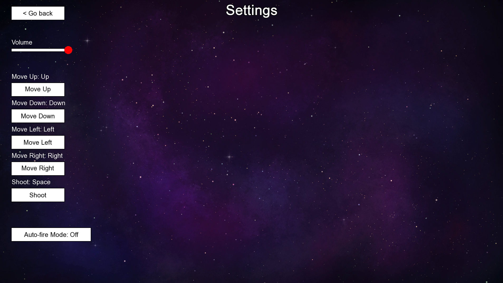

# Accessibility Report

## Introduction
This section assesses the accessibility features of our R-Type game and highlights areas where improvements can be made. Currently, the game includes **volume controls**, **customizable keybindings**, and an **auto-fire mode**. Future plans involve broader accessibility improvements across multiple areas: **general accessibility**, **audio and visual impairments**, **motor impairments**, and **cognitive accessibility**.

## Accessibility Awareness
We recognize that while our game includes foundational accessibility features, it lacks several critical elements needed to fully support a diverse player base. Our current features primarily address general convenience but don't yet meet specific disability needs. We are committed to expanding our accessibility features to support players with physical, visual, auditory, and cognitive disabilities.

## Current Accessibility Features
| Feature                         | Status               | Description                                          |
|---------------------------------|----------------------|------------------------------------------------------|
| **Volume Control**              | Implemented          | Adjustable game volume to suit player preferences.    |
| **Customizable Keybindings**    | Implemented          | Players can bind keys according to their preferences for a more comfortable experience. |
| **Auto-Fire Mode**              | Implemented          | Reduces the need for repetitive button presses by allowing the player to shoot automatically. |

These features lay the groundwork for accessibility, focusing primarily on convenience rather than inclusivity for those with specific disabilities.

## Planned Accessibility Features

### General
1. **Comprehensive Documentation**: Include tutorials, video walkthroughs, and PDF guides optimized for screen readers, making it easier for players to understand gameplay and accessibility options.

### Physical and Motor Disabilities
1. **One-Handed Mode**: Allow players to remap all controls to one hand.
2. **Slow-Motion Mode**: Slow down gameplay to make reaction time less critical.
3. **Expanded Custom Controls**: Build on the current keybinding system to support controllers, mouse, and keyboard as input devices.
4. **Improved Auto-Fire Settings**: Expand auto-fire options with configurable trigger speeds and specific weapon types.

### Audio and Visual Disabilities
1. **Subtitles and Sound Icons**: Display visual cues for important audio events, such as approaching enemies or key notifications.
2. **Colorblind-Friendly Filters**: Color adjustments to avoid confusion for players with colorblindness.
3. **High Contrast Mode**: Shader adjustments to boost contrast for better visibility.
4. **Dyslexia-Friendly Font and Icons**: Accessible fonts and icons to improve readability and reduce cognitive load.

### Cognitive Accessibility
1. **Adjustable Difficulty Levels**: Easier modes with a slower game pace and fewer enemies.
2. **Simple User Interface (UI)**: A minimal, intuitive interface that reduces cognitive load.
3. **Tutorials and Hints**: Visual and audio tutorials, including hints during gameplay to guide players.
4. **Pause/Save Functionality**: Allow players to pause and save their game, reducing pressure for continuous play.

## Accessibility Analysis and Scores

| Category                    | Current Status            | Planned Improvements                                | Score (A-F) |
|-----------------------------|---------------------------|-----------------------------------------------------|-------------|
| **Physical Accessibility**  | Keybindings, Auto-fire    | Slow-motion mode, expanded controls, one-handed mode| B           |
| **Visual Accessibility**    | None                      | Subtitles, Sound icons, Colorblind filters, High contrast, Adjustable text | D |
| **Audio Accessibility**     | Volume control            | Subtitles, Sound icons                              | C           |
| **Cognitive Accessibility** | Simple UI                 | Difficulty settings, Tutorials, Save/Pause feature  | D           |

### Scoring System
- **A**: Fully accessible, with robust features addressing specific accessibility needs.
- **B**: Partially accessible, with some support in place for specific needs.
- **C**: Limited accessibility, with only a few basic features available.
- **D**: Minimal accessibility, with little support for specific needs.
- **F**: Not accessible, no features addressing this aspect.

## User Scenarios

**User Scenario: Alex, a player with limited mobility**  
Alex has limited use of their hands and prefers using a controller over a keyboard. With customizable keybindings and auto-fire mode, Alex finds it easier to play without strain. However, additional support for one-handed play or a slow-motion mode would further improve the experience.

**User Scenario: Jamie, a player with low vision**  
Jamie struggles to differentiate colors in the game due to colorblindness. Planned features like colorblind-friendly filters and high contrast mode would greatly assist Jamie, allowing them to enjoy the game without confusion or visual strain.

**User Scenario: Sam, a player with ADHD**  
Sam has difficulty concentrating on fast-paced games and needs more time to react. With an adjustable difficulty setting and planned pause/save functionality, Sam could play the game at a pace that suits them better.

## Player Warnings
Currently, the game has minimal support for players with severe visual or cognitive disabilities. We recommend caution for players with these needs, as the game may present challenges without added assistive features. Planned updates aim to address these issues and will provide regular updates on accessibility improvements.

## Testing and Player Feedback
To ensure that our accessibility features meet player needs, we plan to conduct user testing with players who have a variety of disabilities. We encourage feedback via forums and reviews and will incorporate suggestions into future updates.

## Conclusion
The game currently includes key accessibility features like volume control, customizable keybindings, and an auto-fire mode, addressing some physical and motor accessibility needs. These features offer significant convenience and inclusivity, particularly for players with motor disabilities. However, more work is needed to accommodate players with visual, auditory, and cognitive disabilities.

Through planned improvements, we aim to create an experience that is accessible to as many players as possible, regardless of their abilities. Regular updates and user feedback will guide our journey towards a more inclusive game.
