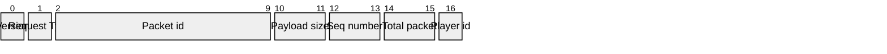
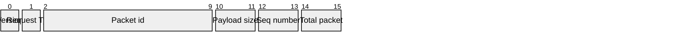
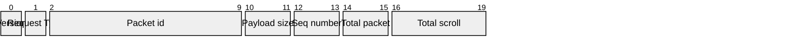
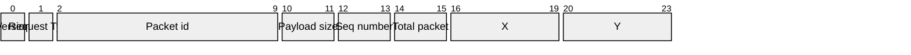
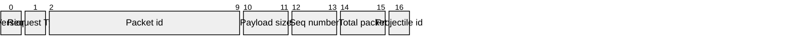
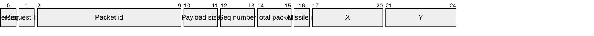

# Network request
Packet description for each request.

- ### PlayerConnect

  - Request type = 0

  - Payload size = 1

- ### PlayerDisconnect

  - Request type = 1

  - Payload size = 1

- ### GameStart

  - Request type = 2

  - Payload size = 0

- ### GameOver

  - Request type = 3

  - Payload size = 0

- ### MapScroll

  - Request type = 4

  - Payload size = 4

- ### TileDestroy

  - Request type = 5

  - Payload size = 8

- ### PlayerProjectileShoot

  - Request type = 6

  - Payload size = 1

- ### PlayerProjectileCreate

  - Request type = 6

  - Payload size = 9

- ### PlayerProjectileDestroy

  - Request type = 6

  - Payload size = 1

- ### PlayerMissileShoot

  - Request type = 7

  - Payload size = 1

- ### PlayerMissileCreate

  - Request type = 7

  - Payload size = 9

- ### PlayerMissileDestroy

  - Request type = 7

  - Payload size = 1

- ### PlayerMove

  - Request type = 7

  - Payload size = 9

- ### PlayerCollide

  - Request type = 8

  - Payload size = 9

- ### PlayerHit

  - Request type = 9

  - Payload size = 1

- ### PlayerDie

  - Request type = 10

  - Payload size = 1

- ### EnemySpawn

  - Request type = 11

  - Payload size = 9

- ### EnemyMove

  - Request type = 12

  - Payload size = 9

- ### EnemyDie

  - Request type = 13

  - Payload size = 1
