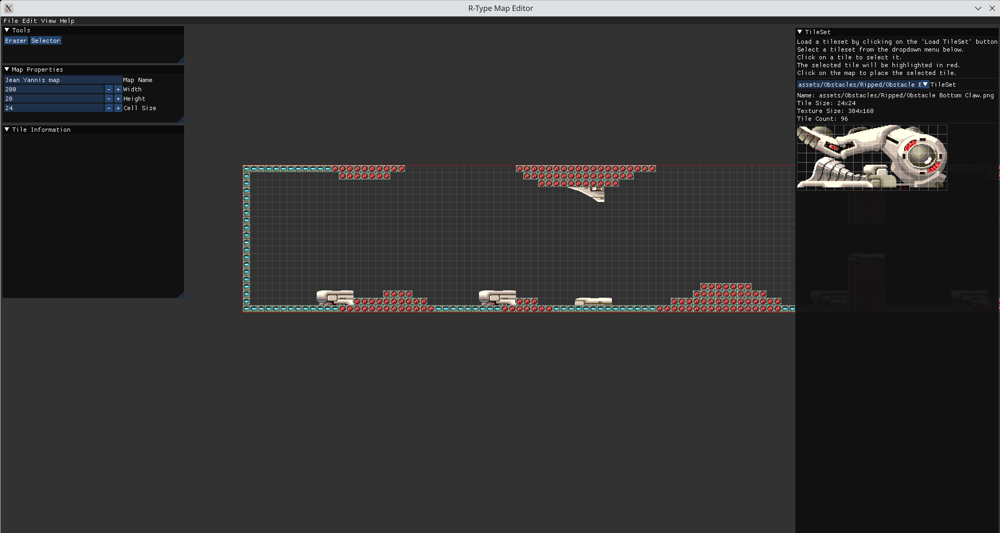

# Get Started



The R-Type Map Editor is a powerful tool designed to create and edit maps for the R-Type game. This editor allows you to place tiles, set spawn points, and configure various map properties.

## Features

- Create new maps with customizable dimensions
- Load and edit existing maps
- Place and remove tiles from various tilesets
- Set spawn points for players and enemies
- Adjust map properties such as name, width, height, and cell size
- Undo and redo actions
- Save maps in JSON format

## Getting Started

To launch the map editor, use the following command:

```bash
./map_editor <map_path>
```


Replace `<map_path>` with the path to your map file. If you're creating a new map, you can specify a new file name.

## Main Interface

The map editor interface consists of several panels:

1. **Main Menu Bar**: Located at the top of the window, providing access to file operations, edit functions, and view options.
2. **Map View**: The central area where you can view and edit your map.
3. **TileSet Panel**: Displays available tilesets and individual tiles for selection.
4. **Tools Panel**: Provides various tools for map editing, such as the tile brush and eraser.
5. **Map Properties Panel**: Allows you to adjust map properties like name, dimensions, and cell size.

## Working with Maps

### Creating a New Map

1. Click on "File" in the main menu bar.
2. Select "New Map".
3. In the dialog that appears, set the desired width, height, and cell size for your new map.
4. Click "Create" to generate the new map.

### Loading an Existing Map

1. Click on "File" in the main menu bar.
2. Select "Open Map".
3. In the file dialog, navigate to and select your map file (usually with a .json extension).
4. Click "Open" to load the map.

### Saving a Map

1. Click on "File" in the main menu bar.
2. Select "Save Map".
3. If it's a new map, you'll be prompted to choose a save location and file name.
4. Click "Save" to store your map file.

## Editing the Map

### Placing Tiles

1. Select a tileset and tile from the TileSet Panel.
2. Click on the map view to place the selected tile.

### Erasing Tiles

1. Select the Eraser tool from the Tools Panel.
2. Click and drag over tiles you wish to remove.

### Selecting Tiles

1. Select the Select tool from the Tools Panel.
2. Click on a tile to select it.
3. Show tiles informations to the "Tile Properties" panel.

### Adjusting Map Properties

Use the Map Properties Panel to change the map's name, dimensions, or cell size. Note that changing dimensions may affect existing tile placements.

## Keyboard Shortcuts

- **Ctrl+Z**: Undo the last action
- **Ctrl+Y**: Redo the last undone action
- **Ctrl+S**: Save the current map
- **Ctrl+O**: Open an existing map

## File Format

The map editor uses a JSON format to store map data. The file includes information about the map dimensions, cell size, tilesets used, and individual tile placements.

For more details on the file format, refer to the [Map File Format](map-file-format.md) documentation.

## Troubleshooting

If you encounter any issues while using the map editor, please check the console output for error messages. Common issues include:

- Incorrect file paths for tilesets
- Invalid JSON format in map files
- Missing required fields in the map configuration

For further assistance, please contact the development team or refer to the project's GitHub repository.