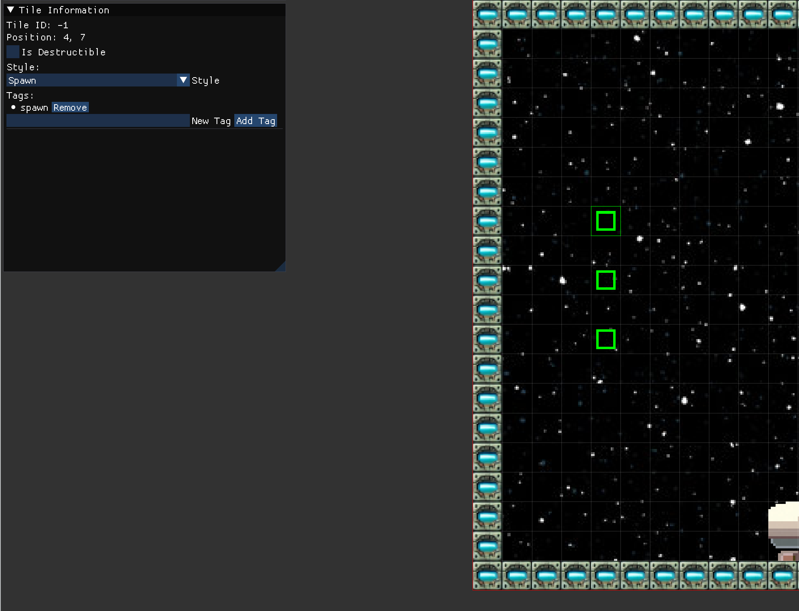

# Adding Tags and Modifying Tile Styles

This guide explains how to add tags and modify tile styles in the map editor.



## Selecting Tiles

1. Use the "Selector" tool in the editor.
2. Click and drag to select one or more tiles on the map.
3. The selected tiles will appear in a list on the left panel.

## Modifying Tile Styles

1. In the left panel, locate the dropdown menu for the selected tile(s).
2. Choose a style from the dropdown menu.
3. The selected style will be applied to the tile(s), helping to visually categorize different tile types.

## Adding Tags

1. Find the input field for tags in the left panel.
2. Type the desired tag into the input field.
3. Click the "Add Tag" button to apply the tag to the selected tile(s).
4. Repeat this process to add multiple tags to a tile.

## Setting Destructible Property

1. Locate the checkbox labeled "Destructible" in the left panel.
2. Check the box to mark the selected tile(s) as destructible.
3. Uncheck the box to mark the tile(s) as indestructible.

## Tile Configuration in JSON

After modifying a tile, its configuration in the `JY_map.json` file will look similar to this:

```json
{
    "isDestructible": true,
    "style": 0,
    "tags": [
        "spawn"
    ],
    "tileIndex": 107,
    "x": 0,
    "y": 0
}
```
