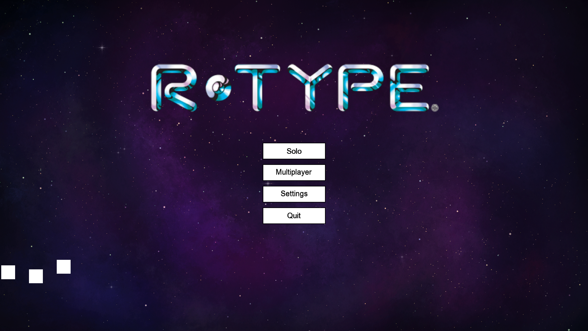

## Welcome to R-Type!

In **R-Type**, you take control of a spaceship, fighting your way through waves of enemies to complete levels. It’s a fun, action-packed game for both solo players and those who want to compete with friends!

### Getting Started

R-Type is a side-scrolling shooter game where you control a spaceship to fight against waves of enemies. To start the game:

:::info
First, you need to compile the project. Please refer to the [Installation Help Page](../Overview/Installation.md) for step-by-step guidance.
:::

1. Launch the game executable.
2. You'll be presented with the main menu.
3. Select "Start Game" to begin your adventure.

### How to Play

- **Move Your Ship**: Use the **arrow keys** to move your spaceship up, down, left, and right.
- **Shoot Missiles**: Press the **space bar** to shoot missiles.
- **Charge Attack**: Hold down the **space bar** to charge a powerful missile. Release to fire a stronger shot!

:::warning Be careful
- Enemies can hurt you if they get too close.
- Your goal is to destroy enemies with your missiles.
- You can change move and shoot keybinds.
:::

### Game World and Obstacles

- Your missiles travel horizontally and can take out enemies in your path. **Press, hold and release the shoot button to shoot missiles**
- Be mindful of the environment! Some levels have objects that you must avoid. If your spaceship crashes into them, it will be destroyed.

### Game Menus

When you start the game, you will see the **Main Menu** with the following options:
1. **Solo**: Dive right into the action and begin your adventure in a predefined room!
2. **Multiplayer**: Enter a room you defined in the configuration file to play with friends!
3. **Settings**: Adjust the game volume, keybinds and modes to your liking.
4. **Exit Game**: Quit the game when you’re ready to take a break. **Press enter to kill the program.**

### Tips & Tricks

1. Learn enemy patterns to anticipate their movements and attacks.
2. Use the environment to your advantage, hiding behind obstacles when necessary.
3. Save your missiles for tougher enemies or boss battles.
4. In multiplayer, coordinate with your teammates to tackle different areas of the screen.

### Settings

1. Adjust volume to your liking.
2. Change keybinds: **click on the keybind to change and then press the key** you want to bind it to. See the input change to the new binded key!
3. Auto-fire mode: projectiles will be shot automatically, just move your player!

### Future Features

Stay tuned for future updates! We plan to introduce:
- **Different difficulty levels** for more challenges.

### Installation Instructions

To install the game, please refer to the [Installation Help Page](../installation/) for step-by-step guidance.
